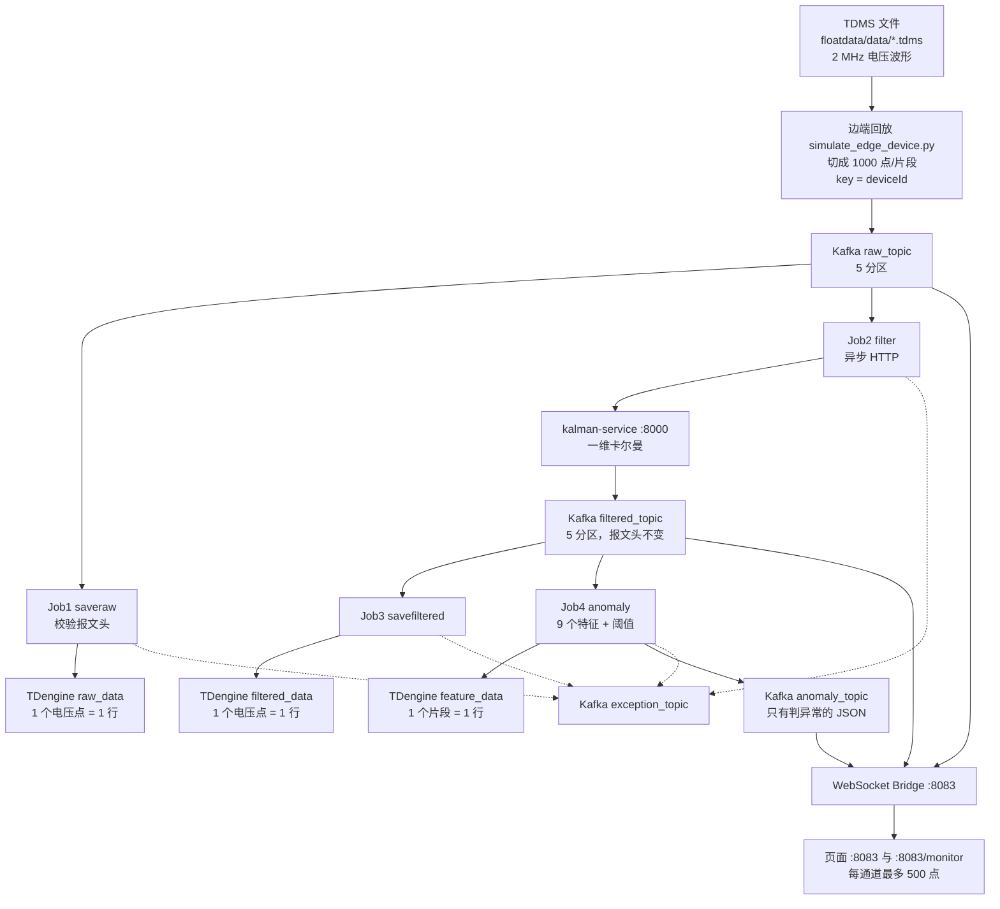

# 声发射检测：数据流、Flink 分层与算法

对照《声发射工业检测平台技术方案》，按当前代码说明数据怎么进来、每一层为什么分开、四个 Flink Job 各自做什么，以及实际用到的算法。

代码位置：`yudao-cloud/yudao-module-detection/`。当前提交参数来自 `scripts/deploy-flink-job.sh`。

---

## 1. 方案要解决的问题

方案要求的链路是：

边端多设备、每台多通道采集 → 网关接入 → Kafka → Flink 流计算 → 滤波 → 时序库 → 特征与异常 → 定位和展示。

吞吐目标是 **8 MB/s**。同一台设备的多个通道必须进同一个 Kafka 分区，保证这一台设备内部的时间顺序。处理失败的数据不能把主链路拖死，要进异常主题。

当前实现保留了这套分层，但有几处和方案原文不一致，文末有对照表。

---

## 2. 数据流（汇报用）

先看分叉，再跟一条具体片段走完。原始数据和滤波数据是两条并行消费，不是「先归档、归档完再滤波」。

### 2.1 全链路



读图时抓住三件事：

1. `raw_topic` 上有两个互不影响的消费者：Job1 只入库，Job2 只滤波。滤波挂了，原始波形仍然在落库。
2. `filtered_topic` 上又有两个消费者：Job3 把滤波波形入库，Job4 把同一段波形收成一行特征。展示服务是第三个消费者，不经过 Flink。
3. 虚线是失败旁路。解析失败、卡尔曼超时、写库失败进 `exception_topic`，主链路继续。

### 2.2 一条片段走完全程

下面用一轮实测里的真实设备走一遍。文件 `data-10-left-1.tdms` 有 2400 万个采样点，采样率 2 MHz。脚本按 1000 点切片段，这一通道最多 24000 个片段。

**第 0 步：文件里的原始波形**

| 项 | 值 |
|---|---|
| 文件 | `floatdata/data/data-10-left-1.tdms` |
| 设备 / 通道 | `DATA-10-LEFT` / 通道 1 |
| 采样率 | 2,000,000 Hz，点与点间隔 500 ns |
| 切法 | 第 seq 个片段取下标 `(seq-1)×1000` 起的 1000 个 float |

同一轮里，脚本对 5 台设备的全部通道各切一刀，打成一批再发。这一台设备有 3 个通道，所以 seq=42 时会连续发出 3 条消息，通道号分别是 1、2、3，片段号和时间基准不同（各通道用自己的文件起点），设备名相同。

**第 1 步：变成一条 Kafka 消息，进入 `raw_topic`**

```text
Key:   DATA-10-LEFT
Value: DATA-10-LEFT:1:42:1681105991850000000,0.000519,-0.000121,0.000341,...
```

| 字段 | 这一条里的值 | 作用 |
|---|---|---|
| Key | `DATA-10-LEFT` | 只用于分区，不参与计算 |
| 分区 | `MD5(key) % 5` | 这台设备的 3 个通道永远进同一个分区 |
| 通道 | `1` | 区分同一设备上的传感器 |
| 片段号 | `42` | 把一次切片里的各通道配成同一次 hit |
| 时间戳 | 纳秒，片段第一个点的时间 | 后面每个点用它加 `i × 500 ns` |
| 逗号后 | 1000 个电压，6 位小数 | 这一跳的正文，大约几 KB 到十几 KB |

这一步还没有进 Flink，也没有进数据库。Kafka 只是按设备把字节排好队。

**第 2 步：从 `raw_topic` 分出两条路（同时发生）**

两条路的 consumer group 不同，各记各的 offset。

路 A，Job1 `signal-saveraw-flink-job`，只归档：

1. 检查逗号前是不是恰好 4 段。不是就写入 `exception_topic`，这条到此结束。
2. 按设备名 `keyBy`，同一设备进同一个 subtask。
3. 消息先积在内存里，满 16 条或满 500 ms 再刷盘。
4. 刷盘时才把 1000 个电压拆开。第 i 个点写成一行：

```text
ts        = 1681105991850000000 + i * 500
voltage   = 该点原文里的数字
sampling  = 2000000
seq       = 42
标签      = device_id=DATA-10-LEFT, channel_id=1
子表      = t_data_10_left_1   （超级表 raw_data）
```

一条 Kafka 消息在这里变成 **1000 行** `raw_data`。波形本身没有被修改。

路 B，Job2 `signal-filter-flink-job`，只滤波：

1. 把逗号后的 1000 个数解析成 JSON 数组。
2. `POST http://kalman-service:8000/filter`，body 是 `{"signal":[...], "filter_type":"kalman"}`。
3. 服务对 1000 个点做一维卡尔曼，返回等长的 `filtered_signal`。
4. Job 用**原来的报文头**拼回 CSV，Key 仍是 `DATA-10-LEFT`，写入 `filtered_topic`。

```text
Key:   DATA-10-LEFT
Value: DATA-10-LEFT:1:42:1681105991850000000,0.000480,-0.000090,...
```

头四个字段和进 `raw_topic` 时一样，变的只有电压。调用失败或 30 秒超时，这条进 `exception_topic`，不会写入 `filtered_topic`，所以后面的归档和特征计算看不到它。原始库里那 1000 行不受影响。

**第 3 步：从 `filtered_topic` 再分出三条路**

路 C，Job3 `signal-save-filtered-flink-job`：

和路 A 同一套拆点、批写。区别是目标表 `filtered_data` 没有 `sampling` 列。这条例子同样变成 **1000 行**，子表 `t_data_10_left_1`，电压是卡尔曼之后的值。

路 D，Job4 `signal-anomaly-flink-job`：

不再按点入库。1000 个滤波电压在进程里算出 9 个特征，收成 **1 行** 写入 `feature_data`：

```text
ts, amplitude, energy, area, skewness, rise_time, hit_duration,
counts, ra, af, is_error, error_type, alert_level, loc_x, loc_y, seq
```

`loc_x`、`loc_y` 固定 0。正常片段也写这一行，`is_error=0`。

只有越过阈值才多写一条到 `anomaly_topic`，例如峰值超限：

```json
{
  "deviceId": "DATA-10-LEFT",
  "channelId": 1,
  "seq": 42,
  "timestamp": 1681105991850000000,
  "amplitude": 0.012,
  "energy": 0.008,
  "errorType": "amplitude",
  "alertLevel": 1
}
```

没超阈值就不到这个主题。下游告警不会看到正常片段。

路 E，WebSocket Bridge，不进 Flink：

同时订 `raw_topic`、`filtered_topic`、`anomaly_topic`。波形消息抽成最多 500 个点的 JSON 推到浏览器；告警消息原样改个 `type=anomaly-alert` 再推。页面上同一通道能同时看到红线（原始）和绿线（滤波）。

### 2.3 每一跳的数据形态

| 跳 | 放在哪 | 一条记录是什么 | 相对上一跳的数量 | 这一跳新增的信息 |
|---|---|---|---|---|
| 0 | TDMS 文件 | 整段连续电压 | — | 采样率、文件名里的设备/通道 |
| 1 | `raw_topic` | 1000 点的一条 CSV | 文件 → 很多条消息 | 片段号、起始时间戳、分区键 |
| 2A | `raw_data` | 1 个原始电压点 | ×1000 | 每个点自己的纳秒时间 |
| 2B | Kalman 服务 | 1000 点的 JSON 数组 | 1 条消息 → 1 次 HTTP | 滤波后的等长数组 |
| 3 | `filtered_topic` | 1000 点的一条 CSV | 与第 1 跳 1:1 | 电压换成滤波值，头不变 |
| 4C | `filtered_data` | 1 个滤波电压点 | ×1000 | 与原始表按时间和 seq 对齐 |
| 4D | `feature_data` | 1 个片段的 9 个特征 | 1000 点 → 1 行 | 峰值、能量、振铃、是否异常、告警等级 |
| 4D' | `anomaly_topic` | 1 条告警 JSON | 只有异常片段才有 | 给展示和以后的定位用，不含波形点 |
| 旁路 | `exception_topic` | 1 条错误 JSON | 失败才有 | 哪个 Job、错误类型、原始报文 |
| 展示 | WebSocket | 1 个通道的一帧 | 抽到 ≤500 点 | `type` 区分原始、滤波、告警 |

数量关系可以记成一句：

**1 条原始消息 = 1000 行原始波形 + 1 次滤波 + 1000 行滤波波形 + 1 行特征 + 0 或 1 条告警。**

### 2.4 为什么不是一条直线

如果做成「边端 → 归档 → 滤波 → 再归档 → 特征」，滤波一慢，原始入库就停；滤波一失败，原始波形也丢。现在的分叉是：

```text
                    ┌─ Job1 归档 ──────────────► raw_data
边端 ─► raw_topic ──┤
                    └─ Job2 滤波 ─► filtered_topic ─┬─ Job3 ─► filtered_data
                                                    ├─ Job4 ─► feature_data
                                                    │         └─► anomaly_topic（仅异常）
                                                    └─ WebSocket ─► 页面
```

`raw_topic` 和 `filtered_topic` 都按 `deviceId` 分区，5 个分区对 5 台设备。一台设备从原始消息、滤波消息到告警，都在同一个分区号上，三通道的先后顺序就是发送顺序。

5 台设备与分区的对应（MD5 取模，这组名字没有撞车）：

| 设备 | 分区 | 通道 |
|---|---|---|
| DATA-15-RIGHT | 0 | 1 / 2 / 3 |
| DATA-10-LEFT | 1 | 1 / 2 / 3 |
| DATA-20-RIGHT | 2 | 1 / 2 / 3 |
| DATA2023-LEFT | 3 | 2 / 3 |
| DATA-10-RIGHT | 4 | 1 / 2 / 3 |

### 2.5 这一轮实测的规模

`simulate_edge_device.py --interval 0 --burst 0` 把上面 5 台设备各走完一遍：

| 项 | 结果 |
|---|---|
| 片段序号 | 1 → 42000（以最长通道 4200 万点为准） |
| 发出的 Kafka 消息 | 348000 条 |
| 发出的正文 | 3210.85 MB |
| 耗时 | 464.6 s |
| 平均吞吐 | 6.91 MB/s |

348000 不是 42000×14。短通道先切完，后面的 seq 只剩还没切完的通道，所以每步发出的通道数会变少。按「1 条消息拆成 1000 行」估算，原始表和滤波表各自大约 3.48 亿行，特征表大约 34.8 万行。告警行数取决于有多少片段越过阈值。

---

## 3. 为什么分成这些层

分层的目的是让「存原始」「滤波」「存滤波结果」「出特征」四件事互不阻塞，并且后面每一层的数据量比上一层小一个数量级。

| 层 | 对应组件 | 为什么单独做 |
|---|---|---|
| 接入 | Kafka `raw_topic` | 采集和计算解耦。边端只负责把片段送进队列，Flink 挂了数据还在。按设备分区后，一台设备的三个通道不会被打散到不同消费者上。 |
| 原始归档 | `signal-saveraw-flink-job` → `raw_data` | 滤波会改波形。出了争议或要重算，必须能回到没处理过的电压。这一层失败不应挡住滤波。 |
| 滤波 | `signal-filter-flink-job` → `filtered_topic` | 滤波是 CPU/网络最重的一步，而且会调用外部服务。把它做成另一条消费，原始归档可以按自己的速度写库。滤波结果再进 Kafka，后面两个 Job 各自消费，不必互相等待。 |
| 滤波归档 | `signal-save-filtered-flink-job` → `filtered_data` | 特征可以重算，但滤波结果重算要再打一遍外部服务。中间结果留下来，回放和前端画波形都读这一层。 |
| 特征与异常 | `signal-anomaly-flink-job` → `feature_data` + `anomaly_topic` | 一个片段 1000 个点，特征只有一行。告警、统计不该去扫波形表。`anomaly_topic` 里只有判为异常的片段，下游不用自己再过滤。 |
| 死信 | `exception_topic` | 方案要求：解析失败、调用失败、写库失败都离开主流程。Job 用 side output 把这些消息送出去，主输出继续。 |

`raw_topic` 被两个 Job 各消费一次（归档、滤波），用的是不同的 consumer group。这是故意的：归档不依赖滤波是否成功。

---

## 4. Kafka：主题、分区、报文

### 4.1 主题

`docker-compose-infra.yml` 里 `kafka-init` 创建：

| 主题 | 分区 | 谁写 | 谁读 |
|---|---|---|---|
| `raw_topic` | 5 | 边端模拟器 | saveraw、filter |
| `filtered_topic` | 5 | filter Job | savefiltered、anomaly、WebSocket |
| `anomaly_topic` | 5 | anomaly Job | WebSocket（方案里的定位/告警服务） |
| `exception_topic` | 4 | 四个 Job | 方案写明「暂时未考虑」后续处理 |

方案写的是 16 分区、起步 8 分区，并且 1 主 2 从。当前是单节点，分区数改成 **5**，和保留的 5 台测试设备对齐：`DATA-15-RIGHT`、`DATA-10-LEFT`、`DATA-20-RIGHT`、`DATA2023-LEFT`、`DATA-10-RIGHT`。Flink 并行度也是 5，一个 subtask 对一个分区。

### 4.2 为什么按设备哈希，而不是轮询

模拟器的分区函数（`simulate_edge_device.py`）：

```text
partition = MD5(deviceId) % 分区数
```

filter Job 写入 `filtered_topic`、anomaly Job 写入 `anomaly_topic` 时，Kafka record 的 key 同样是 `deviceId`。

这样同一台设备的通道 1/2/3、以及这条设备后面的滤波结果和告警，都落在同一个分区里，消费者看到的顺序就是发送顺序。通道之间要做到达时间比较时，不需要再跨分区对齐。

5 台设备和 5 个分区用 MD5 取模，在这组设备名上没有撞车，每台设备独占一个分区。

### 4.3 报文

方案规定的边端报文，代码原样使用：

```text
deviceId:通道号:片段号:时间戳,v1,v2,v3,...
```

示例：

```text
DATA-10-LEFT:1:42:1681105991850000000,0.000519,-0.000121,...
```

| 字段 | 含义 |
|---|---|
| `deviceId` | 设备，同时是分区键 |
| 通道号 | 1/2/3 |
| 片段号 `seq` | 同一设备各通道在同一次切片里相同，用来把三通道配成一次 hit |
| 时间戳 | 该片段第一个采样点的时间，纳秒 |
| 逗号后 | 电压序列，测试脚本每个片段 1000 点，保留 6 位小数 |

滤波之后报文头不变，逗号后面换成滤波电压。异常主题不再用这套 CSV，改成 JSON（见第 6.4 节）。

---

## 5. 四个 Flink Job

四个 Job 的共同设置：

- Checkpoint 间隔 30 秒，用来提交 Kafka offset，挂了能从检查点接着消费。
- 固定延迟重启：最多 3 次，间隔 30 秒。
- 消费起点是 `latest`：Job 启动之后的新数据才会被处理，不会把历史积压再算一遍。
- 写 TDengine 时按 Kafka 消息批处理，默认 **16 条消息或 500 ms** 刷一次，不是按采样点计数。

流水线里传递的是整段 CSV 字符串。解析和「1 条消息拆成 1000 个点」推迟到 Sink 刷盘时才做，避免在 Flink 网络里把流量放大约 1000 倍。

### 5.1 signal-saveraw-flink-job — 原始归档

源码：`signal-flink-jobs/signal-saveraw-job/`

```text
raw_topic → 校验报文头 → 按 deviceId keyBy → TDengineRawSink → raw_data
                └─ 格式不对 → exception_topic
```

校验只看头部：第一个逗号之前必须是 4 段 `设备:通道:片段号:时间戳`。通过的消息原样下发。

`TDengineRawSink` 在刷盘时才拆电压：

- 子表名 `t_{设备}_{通道}`，超级表 `raw_data`，标签是 `device_id`、`channel_id`。
- 每个电压一个 FLOAT 行，不是方案里的 `ARRAY(FLOAT)` 一行一个片段。
- 第 i 个点的时间戳 = 片段起始时间 + i × 500 ns（按 2 MHz 推）。
- 每行带上 `sampling = 2000000` 和原来的 `seq`。
- 写库失败整批进入 `exception_topic`。

这一层不做滤波、不算特征。它只回答「当时采到的电压是什么」。

### 5.2 signal-filter-flink-job — 滤波

源码：`signal-flink-jobs/signal-filter-job/`

```text
raw_topic → 异步 HTTP 调用 Kalman 服务 → 正常结果写入 filtered_topic
                                      └─ 超时 / 非 200 / 解析失败 → exception_topic
```

当前启动参数：

```text
http://kalman-service:8000   filter_type=kalman
```

实现用的是 Flink `AsyncDataStream.unorderedWait`：最多 100 个在途请求，单次超时 30 秒。调用是 **HTTP POST `/filter`**，不是方案里的 gRPC。`unorderedWait` 表示异步返回顺序不保证和进入顺序一致；分区键仍是 deviceId，分区内的严格顺序不在这一步维持。

请求体：

```json
{ "signal": [0.000519, -0.000121], "filter_type": "kalman" }
```

服务返回 `filtered_signal` 后，Job 用原报文头拼回 CSV，key 仍为 deviceId，写入 `filtered_topic`。

仓库里还有一个 Java 巴特沃斯带通 `ButterworthBandpass`（2 MHz 采样，100 kHz–900 kHz）。**当前这条 Job 没有调用它**，在跑的滤波只有下面的一维卡尔曼。

### 5.3 signal-save-filtered-flink-job — 滤波结果归档

源码：`signal-flink-jobs/signal-savefiltered-job/`

```text
filtered_topic → 同样的 4 段报文校验 → 按 deviceId keyBy → filtered_data
```

和 saveraw 同一套批写方式，区别是表里没有 `sampling` 列。方案里的表名 `filted_data` 在实现里是 `filtered_data`。

### 5.4 signal-anomaly-flink-job — 特征与异常

源码：`signal-flink-jobs/signal-anomaly-job/`

```text
filtered_topic → 解析电压 → AeFeatureCalculator
        ├─ 每个片段一行 → feature_data（正常和异常都写）
        ├─ 仅 is_error=1 → anomaly_topic（JSON）
        └─ 解析/计算异常 → exception_topic
```

方案写的是「异步调用异常检测微服务，由服务把异常推到 anomaly topic」。当前没有这台服务。9 个特征和阈值判断都在 Flink 进程里用 Java 完成，不发 HTTP。

默认阈值（`deploy-flink-job.sh`，可用环境变量覆盖）：

| 参数 | 默认 | 含义 |
|---|---|---|
| `AMP_THRESHOLD` | 0.009 | 峰值电压 |
| `ENERGY_THRESHOLD` | 0.005 | 能量（电压平方和） |
| `COUNTS_THRESHOLD` | 72 | 振铃计数 |

判定是互斥的，按峰值 → 能量 → 振铃的顺序，命中一个就停：

- 峰值 ≥ 0.009 → `errorType=amplitude`
- 否则能量 ≥ 0.005 → `errorType=energy`
- 否则振铃 ≥ 72 → `errorType=counts`
- 否则 `is_error=0`，不进 `anomaly_topic`

告警等级用阈值的倍数，对应方案里的三级：

| 等级 | 条件 | 方案里的说法 |
|---|---|---|
| 1 关注 | ≥ 1.0 × 阈值 | 约 3σ |
| 2 预警 | ≥ 1.33 × 阈值 | 约 4σ（4/3） |
| 3 报警 | ≥ 1.67 × 阈值 | 约 5σ（5/3） |

`feature_data.loc_x`、`loc_y` 固定写 `0.0`。定位留给后续，这个 Job 不算位置。

`anomaly_topic` 的 JSON 字段：`deviceId`、`channelId`、`seq`、`timestamp`、九个特征、`errorType`、`alertLevel`。

---

## 6. TDengine 怎么分层

库名 `yudao_detection`，时间精度纳秒，保留 3650 天。超级表 + 标签，子表按 `设备_通道` 自动建。标签用来按设备、通道裁剪，不用在查询里扫全表。

| 超级表 | 一行是什么 | 为什么这一层存在 |
|---|---|---|
| `raw_data` | 一个原始采样点 | 可追溯。波形查询按时间取一段电压。 |
| `filtered_data` | 一个滤波后采样点 | 和原始波形对齐比较，前端画滤波后的线。 |
| `feature_data` | 一个片段的特征 | 比波形小三个数量级。告警列表、统计走这张表。 |
| `detection_results` | 旧版兼容 | 当前四个 Job 不写这张表。 |

和方案 DDL 的差别：

| 方案 | 当前代码 | 原因 |
|---|---|---|
| `voltage ARRAY(FLOAT)`，一行一个片段 | `voltage FLOAT`，一行一个点 | 按点写，时间和现有查询、WebSocket 抽点一致；超级表上的数组类型没有按方案落地。 |
| 列名 `duration`、`level` | `hit_duration`、`alert_level` | 这两个词是 TDengine 保留字。 |
| `loc_x` / `loc_y` 由定位服务写入 | 入库时写 0 | TDOA 还没做。 |

`raw_data` / `filtered_data` 的行数 ≈ 片段数 × 每片段点数。`feature_data` 的行数 ≈ 片段数。

---

## 7. 算法

### 7.1 分区：MD5 取模

不是信号处理算法。用来保证「一台设备的全部通道 → 同一个分区」。见第 4.2 节。

### 7.2 卡尔曼滤波（当前滤波链路实际在用）

实现：`docker/kalman-service/kalman_service.py`，一维标量卡尔曼，逐点递推。

状态就是当前电压估计 \(x\)，方差 \(p\)。过程噪声 \(q = 10^{-3}\)，测量噪声 \(r = 10^{-2}\)（请求里可以改 `process_noise_var`、`measurement_noise_var`）。

对第 k 个采样点：

```text
p_pred = p + q
K      = p_pred / (p_pred + r)
x      = x + K * (z_k - x)
p      = (1 - K) * p_pred
```

\(z_k\) 是原始电压，输出 \(x\) 是滤波电压。K 大说明更信测量，K 小说明更信上一拍的估计，用来压掉测量噪声。

服务同时提供：

- `POST /kalman/audio/run`：盛老师接口形态
- `POST /filter`：给 Flink Job 用的兼容接口，多返回 `filter_type`、`sample_count`

这是平滑，不是方案正文里的「带通 + 去噪 + 基线校正」三步。基线校正没有单独一步。

### 7.3 巴特沃斯带通（代码在，当前 Job 未接入）

实现：`signal-flink-common/.../filter/ButterworthBandpass.java`。

4 阶巴特沃斯带通，拆成两级二阶节：高通去掉机械振动和工频，低通去掉高频电子噪声。采样 2 MHz 时默认通带 **100 kHz–900 kHz**（900 kHz 低于奈奎斯特频率 1 MHz）。

系数用双线性变换，从模拟巴特沃斯原型得到，公式来自 Audio EQ Cookbook。差分方程是直接 II 型转置：

```text
y[n] = b0*x[n] + b1*x[n-1] + b2*x[n-2] - a1*y[n-1] - a2*y[n-2]
```

滤波器有 8 个状态量，注释里写了可以交给 Flink state 做连续波形。`signal-filter-flink-job` 没有引用这个类。

### 7.4 声发射特征（GB/T 18182 这一路参数）

实现：`AeFeatureCalculator`。输入是一个片段的电压数组，采样率默认 2 MHz，阈值比例默认 0.25。

设电压 \(v_i\)，点数 \(n\)，采样间隔 \(\Delta t = 1/f_s\)。

| 特征 | 计算 | 物理含义 |
|---|---|---|
| amplitude 峰值 | \(\max \|v_i\|\) | 这一段里最强的电压 |
| energy 能量 | \(\sum v_i^2\) | 未再乘 \(\Delta t\)，是平方和 |
| area 面积 | \((\sum \|v_i\|) \Delta t\) | 绝对幅度对时间的积分 |
| skewness 偏度 | 三阶中心矩 / \(\sigma^3\) | 波形相对均值是否左右不对称 |
| 门槛 | \(0.25 \times amplitude\) | 用来找振铃，不是异常阈值 |
| counts 振铃 | \(\|v\|\) 从门槛下穿到门槛上的次数 | 一个 hit 里振荡了几下 |
| rise_time 上升时间 | 第一次过门槛到峰值的时间 | 起振有多快 |
| duration 持续时间 | 第一次过门槛到最后一次过门槛 | 事件拉了多长；入库列名 `hit_duration` |
| RA | rise_time / amplitude | 上升时间相对幅度，裂纹分类里和 AF 一起用 |
| AF | counts / duration | 平均频率意义下的振铃密度 |

门槛用峰值的 25%，所以每个片段的振铃门槛不同。异常判定用的是另一套固定阈值（0.009 / 0.005 / 72），两者不要混。

### 7.5 阈值告警

见第 5.4 节。没有接入方案里的 AI 模型，只有这三条规则。

### 7.6 TDOA 定位（方案有，代码未做）

方案第（5）层：定位服务消费 `anomaly_topic`，用异常点的时间和幅度做到达时间差（TDOA），解出缺陷坐标，写回 `loc_x`、`loc_y`。

当前没有这个服务。`TDengineFeatureSink` 把这两列写成 0，注释写明留给后续。

### 7.7 展示抽点

方案：告警时按设备 ID 和时间去 TDengine 取这段波形，前端只画前 500 个点。

当前展示不查 TDengine。`websocket-bridge` 直接消费 Kafka，每个通道最多下发 **500** 个点（`MAX_DISPLAY_SAMPLES`），原始和滤波两条线一起推，告警 JSON 单独推。推送节流默认 200 ms。页面：

- http://localhost:8083/ 简易波形（`index.html`）
- http://localhost:8083/monitor 波形、告警、特征（`monitor.html`）

---

## 8. 异常流

四个 Job 都把失败从主输出拆出去。JSON 形如：

```json
{
  "job": "signal-filter-flink-job",
  "error_type": "timeout",
  "error_msg": "filter-gateway call timed out (30s)",
  "original_msg": "DATA-10-LEFT:1:42:...,0.001,...",
  "device_id": "DATA-10-LEFT",
  "channel_id": "1",
  "seq": "42"
}
```

| error_type | 来源 |
|---|---|
| `parse_error` | 没有逗号，或头部不是 4 段 |
| `filter_error` | Kalman 服务非 200、缺 `filtered_signal`、报文解析异常 |
| `timeout` | 异步滤波 30 秒没返回 |
| `feature_error` | 特征计算抛异常 |
| 写库失败 | Sink 捕获 SQL 异常后写入，带上失败条数 |

方案写明 exception 的后续处理暂时不做。现在没有消费者专门处理这个主题。

---

## 9. 方案原文和当前代码的差别

| 方案 | 当前实现 |
|---|---|
| Netty 网关集群接入边端 | 测试链路用 TDMS 回放脚本；检测模块里另有 Netty 代码，未接这条 Flink 流水线 |
| gRPC 异步调滤波微服务（带通、去噪、基线） | HTTP 调 `kalman-service` 的一维卡尔曼；巴特沃斯类未挂到 Job 上 |
| 异步调异常检测微服务，再由服务写 `anomaly_topic` | Flink 内算特征并直接写 `anomaly_topic` |
| 分区 16（起步 8），副本 1 主 2 从 | 单机；raw/filtered/anomaly 5 分区，exception 4 分区 |
| `voltage` 用数组，一行一个片段 | 一行一个采样点 |
| TDOA 定位写 `loc_x` / `loc_y` | 列在，值恒为 0 |
| 告警服务查 TDengine 再展示 | WebSocket 桥从 Kafka 抽 500 点推给页面 |
| 表名 `filted_data`，列 `duration`、`level` | `filtered_data`，`hit_duration`，`alert_level` |

分层本身和方案一致：原始归档、滤波、滤波归档、特征/异常、死信，五段分开。变的是滤波和异常检测没有独立微服务集群，以及定位还没做。
